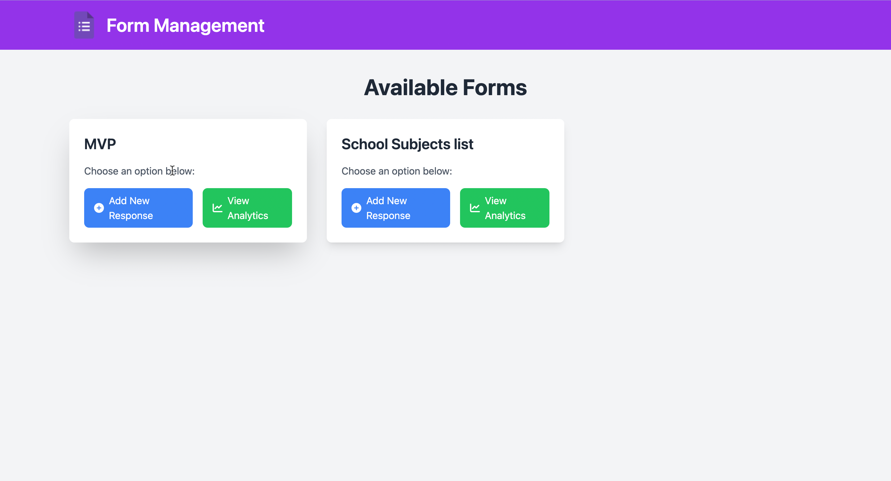
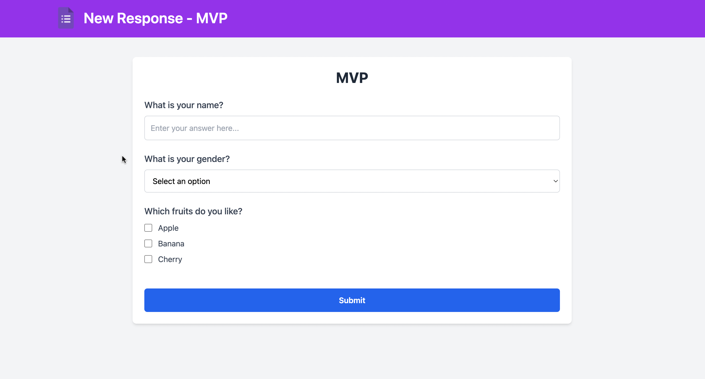
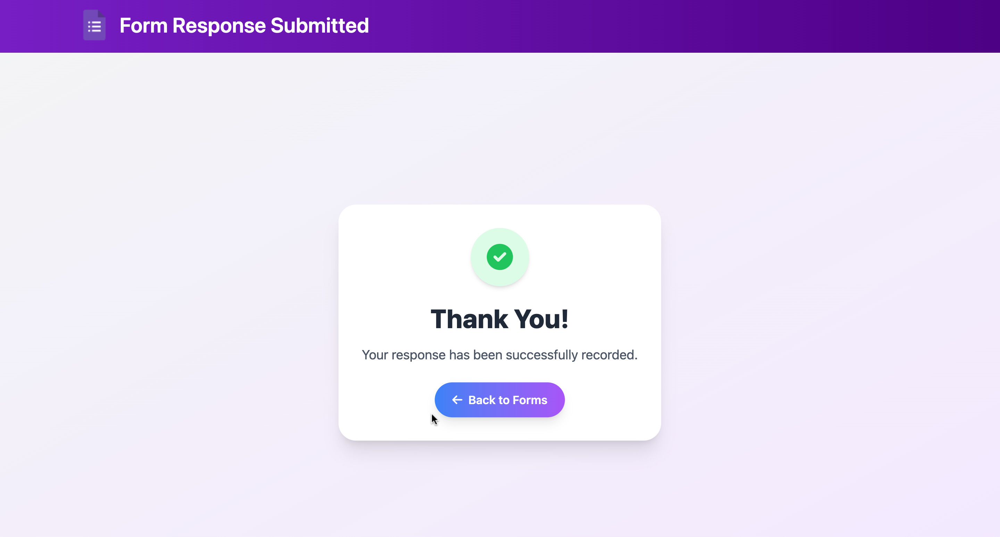
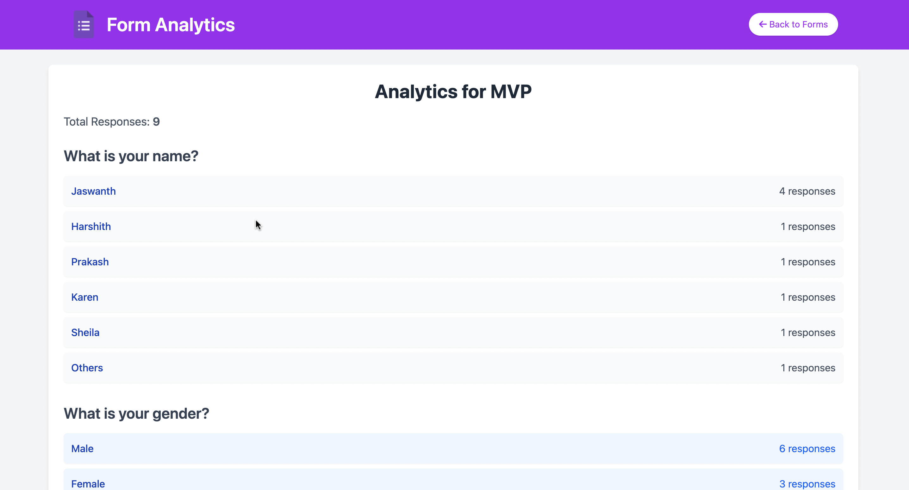

# Form Builder Application

## Overview
This project is a Form Builder application similar to Google Forms. It allows Admins to create forms, Users to submit responses, and both parties to access analytics.

## Setup Instructions

### Prerequisites
- Python 3.x
- Django 3.x
- Tailwind CSS
- Font Awesome CSS
- PostgreSQL
- Git

### Clone the Repository
First, clone the repository from GitHub:
```sh
git clone <repository_url>
cd form_builder
```
### Install Python Dependencies
Create a virtual environment and activate it:

```sh
python -m venv env
source env/bin/activate  # On Windows, use `env\Scripts\activate`
```
### Install the required packages:

```sh
pip install -r requirements.txt
```

### Configure Database
Update your settings.py to configure the PostgreSQL database:
```
DATABASES = {
    'default': {
        'ENGINE': 'django.db.backends.postgresql',
        'NAME': 'form_builder_db',
        'USER': 'your_user',
        'PASSWORD': 'your_password',
        'HOST': 'localhost',
        'PORT': '5432',
    }
}

```
### Apply Migrations
Run the following commands to create the database tables:

```sh
python manage.py makemigrations
python manage.py migrate
```
### Create Superuser
Create a superuser to access the admin interface:
```
python manage.py createsuperuser
```

### Start the Development Server
Run the development server:
```sh
python manage.py runserver
```
Visit http://127.0.0.1:8000/ to access the application.

### Detailed Usage Guide

- ### Admin User

1) **Create Forms:**
   - Navigate to the admin interface at [http://127.0.0.1:8000/admin/](http://127.0.0.1:8000/admin/).
   - Log in using your superuser credentials.
   - Click on the "Forms" section to create a new form.
   - Add questions to the form with the desired question types (Text, Dropdown, Checkbox).

2) **View Forms:**
   - Visit [http://127.0.0.1:8000/](http://127.0.0.1:8000/) to see a list of all forms you have created.
     

- ### End User

1) **Submit Responses:**
   - Access the form list at [http://127.0.0.1:8000/](http://127.0.0.1:8000/).
   - Click on a add new response button of form to open the form detail page and add new response.
   - Fill out the form and submit your responses.

     
     
   -Form Submission Sucess Page

    


### Shared Features

1) **View Analytics:**
   - Append `/analytics/` to the form detail URL to access the analytics page.
   - Example:[http://127.0.0.1:8000/](http://127.0.0.1:8000/)
   - Click on a analytics button of form to open the analytics page and see the analytics of the page.

2) **Accessing Analytics Directly:**
   - You can directly go to the analytics page for any form by navigating to [http://127.0.0.1:8000/forms/5/analytics/](http://127.0.0.1:8000/forms/5/analytics/) (replace "5" with the form ID).

       

